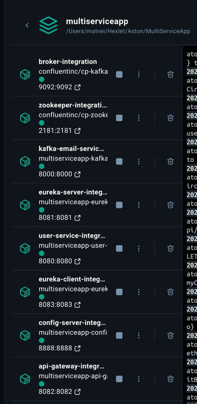

## Мультисервисное приложение

## Инструкция по запуску

1. В файле `docker-compose.integration.yml` нужно в двух местах изменить логин и пароль (код приложения)
от почты, чтобы приложение могло отправлять уведомления. Поменять логин и пароль нужно именно в двух местах.
Оба места содержат две одинаковые строчки:

        SPRING_MAIL_USERNAME: ${SPRING_MAIL_USERNAME}
        SPRING_MAIL_PASSWORD: ${SPRING_MAIL_PASSWORD}
2. Далее в папке с файлом `docker-compose.integration.yml` нужно набрать команду 

        docker-compose -f docker-compose.integration.yml up
3. В Docker должен появиться контейнер со следующими сервисами. После изображения есть инструкция по использованию:

Использование приложения: 

1. User-Service можно использовать по адресу `http://localhost:8080/swagger-ui/index.html#/`
- Там уже прописаны все рабочие маршруты сразу со примерами подходящих данных. Для проверки отправки
уведомления на почту в методе `POST /api/users` можно прописать свою настоящую почту — на нее придет уведомление о 
создании пользователя. Если этого пользователя удалить в методе `DELETE /api/users/{id}`, то также придет
уведомление на его почту.
2. Список зарегистрированных сервисов в Spring Eureka можно посмотреть по адресу `http://localhost:8081/`
- Запросы к User Service можно также отправлять через Api-Gateway. 
- Например, если перейти на страницу `http://localhost:8082/api/hello`, то при работающем сервисе User Service 
ошибок не будет. Но если в контейнере выключить `user-service-integration`, то сразу появится сообщение о
недоступности сервиса благодаря Circuit breaker. Если вновь включить User-Service в контейнере, то примерно
через 30 секунд сервис вновь станет доступен.

Для теста программы можно также использовать следующие команды. 
Все они будут обращаться через `http://localhost:8082/`, которая стала единой точкой входа для нескольких модулей.

1. Создание пользователя

`curl -X POST http://localhost:8082/api/users \ -H 
"Content-Type: application/json" \ -d '{ "name": "John", "email": "john@example.com", "age": 30 }'`

2. Просмотр пользователей. Их также можно посмотреть просто по адресу http://localhost:8082/api/users

`curl -X GET http://localhost:8082/api/users`

3. Обновление пользователя

`curl -X PUT http://localhost:8082/api/users/1 \ 
-H "Content-Type: application/json" \ 
-d '{ "name": "John Updated", "email": "john.updated@example.com", "age": 31 }'`

4. Удаление пользователя

`curl -X DELETE http://localhost:8082/api/users/1`

